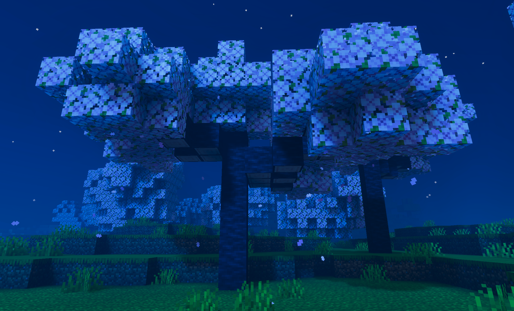

# CherrySapling

CherrySapling is a simple plugin that introduces cherry saplings to the server, enabling them to grow just like regular trees.

## 📌 Features
- Adds cherry saplings into the server
- Natural growth like vanilla trees
- Lightweight and easy to use
- Compatible with most servers

## ⚙️ Installation
1. Download the plugin `.phar` file
2. Put it into the `plugins/` folder of your server
3. Restart the server

## 🚀 Usage
- Obtain cherry saplings in-game (via command or creative inventory)
- Plant them like normal saplings
- Wait for them to grow naturally

## 🔧 Configuration
This plugin currently does not require configuration.

## 📦 Requirements
- PocketMine-MP server
- API version compatible with your plugin

## 🐞 Issues & Support
If you encounter any bugs or issues, please report them on GitHub.

## 📄 License
This project is open-source and available under the MIT License.

## 👤 Author
- BeeAZ
